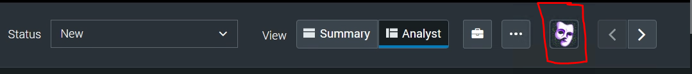
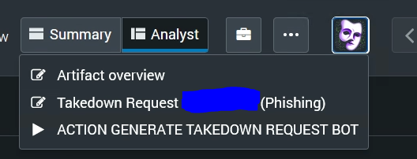
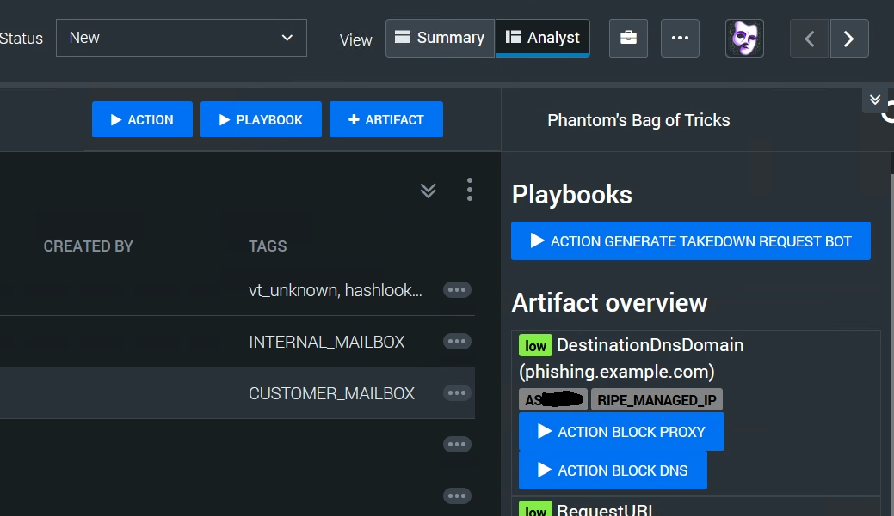
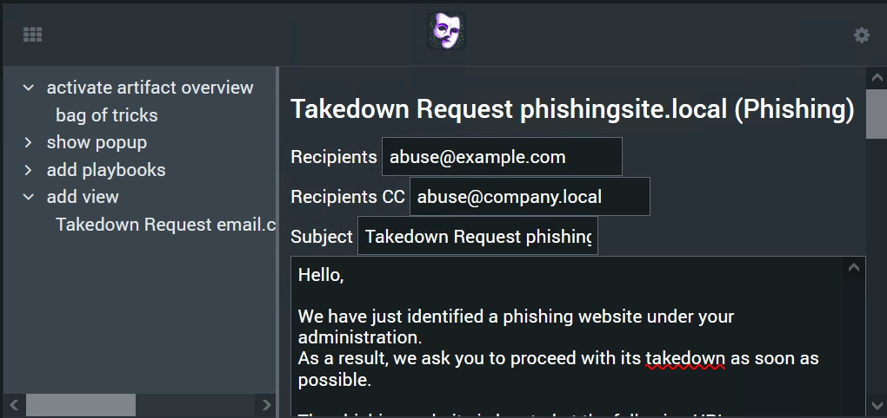
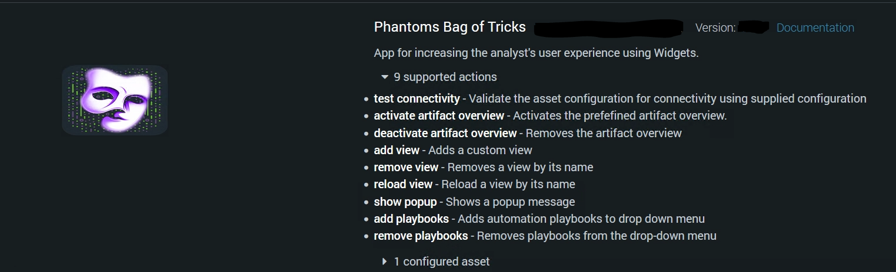
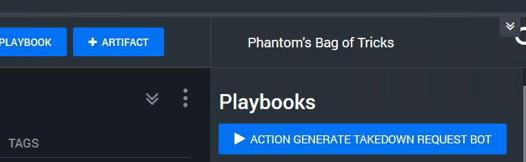
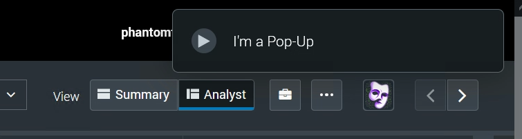
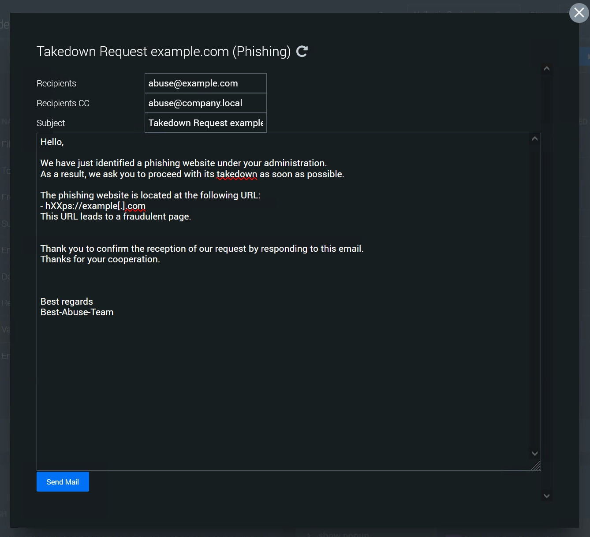
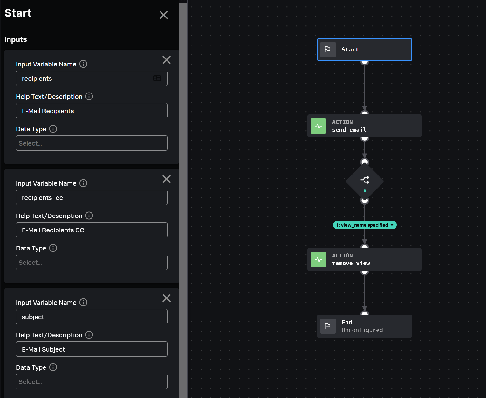

# Phantom's Bag of Tricks
> Yes, I'm aware of the fact, that the abbreviation is BoT

The **Phantom's Bag of Tricks** is a Splunk SOAR app that makes it possible to add UI elements to the SOAR web UI using actions in playbooks. So it is possible to show some forms with prefilled fields and buttons which executes input playbooks and pass the field values to it. You can also add Buttons, which executes specific playbooks or display pop-ups.

## Important to know - how it works
Be aware of the fact, that a custom javascript, which is loaded alongside with the app's widget, is used to add these components to the SOAR Web-UI. This also means that the elements can only be displayed if the widget is also loaded and displayed. This is the case, when the Analyst uses the analyst view of an event where any action of the Bag of Tricks App was executed and the App-widget is not hidden. **The components can not be loaded in the summary view as there are no widgets in it.** Once the widget is loaded and the elements are displayed, the analyst can switch to the Notes tab and is still able to use the elements of the App even if the widget is no longer displayed. The app  remains available until the page is reloaded, for example when the analyst navigates to another event.
### Real-Time UI updates
If an action adds, updates or removes an item in the App, the widget is automatically reloaded by SOAR, this is the normal behavior, as long as the widget is displayed. If this is the case, the update will be applied immediately after the action is executed. If the widget is not displayed at this time, the updates are applied, next time when the widget is loaded. The same applies to pop-ups!

### Other current limitations which should change in future:
- Artifact overview doesn't support input playbook yet.
- Changes in overlay forms are not reflected in sidebar and are lost when the overlay is closed
- Reload in sidebar currently triggers a reload, which only reloads changed views.
- The App settings to enable button and sidebar doesn't have an effect, the button and the sidebar are enabled regardless of these settings.
## UI Elements

### Button
The Phantom's Bag of Tricks App places an additional button on the right side of the title bar, which is used to open overlay forms, execute added playbooks and shows or hides the sidebar. 
*I've given my best to design a button which shows a phantom, maybe I replace the icon by a better one at some time.*

By a click on the Button, the drop-down menu is displayed:

The behavior of the drop-down menu is the same as the built-in one, where you have to click the button again to hide the menu - which isn't perfect but I've kept it for consistency.

### Sidebar
By a right-click on the button, the sidebar is shown:

The sidebar shows each element, which is added to it. The content of each view can be hidden or unhidden by a klick on the view title.

### Widget
And the widget itself also show the elements:



## App-Actions
The App provides several functions, which can be used in playbooks to add views and playbooks to the drop-down menu and the sidebar. There is currently one predefined view, the **Artifact overview** which has its own action and configuration. There could be more of these predefined actions in future, currently I plan to implement one which provides a simpler workbook view.

Each of the actions can show a pop-up, which is only displayed, when the app is already loaded at the time the action is executed. Pop-Ups are not displayed delayed, which is a limitation to mitigate pop-ups shown multiple times.
When a pop-up is clicked, it will be removed. When it is defined by the `add view` or `activate artifact overview` action, a click on the pop-up also opens the overlay form for the specific view. Also `show popup` can refer to a view by view name.

## Views
Each view has a unique Name, which is also used as title. If you execute the `add view` action with the same view name twice, the view will be updated. Also the actions `remove view` and `update view` applies to the view with the specified name. The predefined view **artifact overview** has also a name which is "Artifact overview", so don't use this name for a custom view.
### Add view
This action provides the ability to create custom HTML views. The view can contain any HTML content. To provide the ability of triggering playbooks, the HTML content must contain one or more button elements containing the class 'bot-playbook' the following attributes: - soar-playbook-id: repository/playbook_name - soar-playbook-scope: all, new or a JSON formatted list of artifact IDs For input playbooks the HTML view can also contain HTML inputs like textboxes, textareas, dropdowns, checkboxes or radiobuttons which must have the class 'bot-value' and the attribute 'playbook-input' which specifies the name of the playbooks input variable. The value of these input elements is provided as input for the specified input playbook. When the 'add view' action is executing with an already existing 'view_name', the concerning view will be updated/overwritten.

### Remove view
Removes a view by its name
### Reload view
The 'reload view' action forces a reload of an already displayed view. The reload also happens when the inputs of the view are already filled out. As by all actions of this app, updates are only triggered in a scheduled manner or when a widget reload is triggered by an action run, there can be a delay between the action execution and the actual reload of the view. Use this action wisely.
### Activate Artifact overview
Activates the predefined artifact overview. This View provides a list of artifacts which can be filtered by several attributes. Alongside with the artifact, the list contains playbooks which can be triggered for the specific artifact - which means that the scope of the artifact is used for the playbook execution. Currently only automation playbooks are supported, I've planned to remove this limitation in future.
Only automation playbooks are displayed which are tagged with at least one type name which the artifact includes at at least one cef field. 

### Deactivate Artifact overview
Removes the Artifact overview
## Playbooks
You can add a list of automation playbooks to the drop-down menu and to the sidebar. I think it is easier to execute a playbook from there, than searching it in the built-in playbook menu. In the sidebar the playbooks are shown in a dedicated view.

## Pop-Ups
Using the action `show popup` it is possible to show a pop-up. Unless the pop-up isn't enforced by selecting `enforce_popup`, the pop-up is only shown when the Web-UI is already opened and the widget already loaded. It the pop-up is enforced, it will be shown each time the event is opened, because the information, that the pop-up was already displayed isn't stored.


## Overlay forms
Each view can also be displayed as overlay form, when it's opened from the drop-down menu. This looks like the overlay forms of approver tasks:

Overlay forms are not automatically closed by clicking on the playbook button. But the executed playbook can execute the `remove view` action which also closes the overlay form. As there is a playbook triggered and an action executed which reloads the widget, this can take a while. Note: the widget must be displayed that this works.

## Usage
The Bag of Tricks App is designed in a way, to reduce the analysts effort to get something done in a way to reduce the number of clicks. This can include simple things like adding playbooks to the drop-down menu or to the sidebar. By activating the artifact overview the analyst can easily execute playbook in the scope of a specific artifact. Custom views are more complex.
### Custom views
The desired workflow for the usage of custom views consists of three parts:
- Prepare and add the custom view, which must be done in a playbook. This playbook can run automatically after event creation or when the analyst triggers this playbook. (Add the playbook using add playbook)
- The analyst interacts with the View, maybe changes something and klicks on a button which executes the specified input playbook.
- The input playbook gets the field values passed as inputs, executes something and removes the view.

#### View content - HTML
The view content is defined using HTML. The HTML can also include inline CSS style. There are some important elements, classes and attributes, which are used by the app to execute a playbook and pass the values to it.

##### Buttons
All HTML buttons, with class `bot-playbook` executes playbooks. This buttons must have the following HTML attributes:
- soar-playbook-id: specifies the playbook in the form `repo/playbook-name`
- soar-playbook-scope: specifies the scope, where the playbook should be executed ('all' or 'new')

There is the optional attribute (`pack-input`) where the value doesn't matter. If this attribute is specified, all of the values are passed as dictionary to a single playbook input parameter. This can be useful when the number of parameters is variable. This can be the case, when the number of inputs is based on the number of artifacts.

##### Values
To specify the input parameters for an input playbook, the class 'bot-value' can be added to various HTML elements. Additional the HTML attribute `playbookinput` must be set, where the value of the attribute specifies the name of the playbooks input parameter. As value the value of the element is used but there are exceptions for checkboxes and radio buttons where checked is used as value.
##### HTML example:
```html
<div>
    <label>Recipients</label>
    <input type="text" class="bot-value" playbookinput="recipients" value="{recipients}">
    <br>
    <label>Recipients CC</label>
    <input type="text" class="bot-value" playbookinput="recipients_cc" value="{recipients_cc}">
    <br>
    <label>Subject</label>
    <input type="text" class="bot-value" playbookinput="subject" value="{subject}">
    <br>
    <textarea class="bot-value" playbookinput="body" rows="30" cols="60" style="overflow-y: scroll; width: 100%;">{body}</textarea>
    <input type="text" class="bot-value" playbookinput="remove_view" hidden value="{view_name}">
    <br>
    <button class="btn btn-phantom-primary bot-playbook" soar-playbook-id="local/inputaction_send_mail" soar-playbook-scope="all">Send Mail</button>
</div>
```

And the input Playbook which is triggered by klick on the Button:



##### Select
Sure this also works with select elements:
```python
def createSeveritySelector(artifact_id, selected_severity):
  option_template = '<option value="{value}" {selected}>{display_name}</option>'        
  select_element = '<select playbookinput="{artifact_id}_severity" class="bot-value">{options}</select>'

  options = ''
  for severity in ['High', 'Medium', 'Low']:
        options = options + option_template.format(
          value = severity.lower(),
          display_name = severity,
          selected = 'selected' if selected_severity.lower() == severity.lower() else ''
        )
  return select_element.format(artifact_id=artifact_id, options=options)
```
